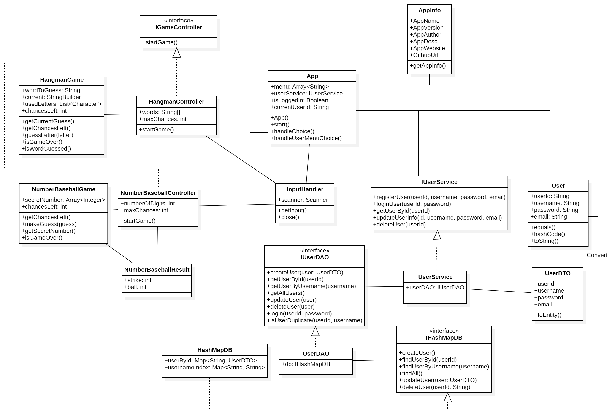

## 종합 연습 문제

## 1. 요구분석

### 1.1. 요구사항

- 메뉴:
  - 애플리케이션 정보
  - 숫자 야구 게임
  - 행맨 게임
  - 회원가입
  - 로그인
  - 종료

### 1.2. 기능 목록

- 애플리케이션 정보
  - 애플리케이션 이름, 버전, 제작자 정보 출력

- 숫자 야구 게임
  - 컴퓨터가 3자리 숫자를 생성
  - 사용자가 숫자를 입력
  - 사용자가 입력한 숫자와 컴퓨터가 생성한 숫자를 비교
  - 스트라이크와 볼의 개수를 출력
  - 사용자가 3스트라이크를 입력할 때까지 반복
- 행맨 게임
  - 컴퓨터가 단어를 선택
  - 사용자가 알파벳을 입력
  - 사용자가 입력한 알파벳이 단어에 포함되어 있는지 확인
  - 맞으면 해당 알파벳을 출력, 틀리면 시도 횟수를 감소
  - 시도 횟수가 0이 되면 게임 종료
- 회원가입
  - 사용자 정보를 입력받아 회원가입 처리
  - 사용자 정보:
    - id
    - password
    - name
    - email
  - id와 name을 이용해 중복 확인
- 로그인
  - 추가된 회원정보를 활용
  - id와 password를 입력받아 로그인 처리
  - 로그인 성공 시 환영 메시지 출력
- 종료
  - 프로그램 종료

## 2. 클래스 목록

- **AppInfo**
  - 애플리케이션 정보를 담는 클래스
  - 이름, 버전, 제작자 정보 포함
- Database
  - **IHashMapDB**
    - HashMapDB 인터페이스
    - 사용자 정보 추가, 조회, 수정, 삭제 메소드 정의
  - **HashMapDB**
    - HashMap을 이용한 데이터베이스 클래스
    - 사용자 정보를 HashMap에 저장하고 관리
    - 사용자 정보 추가, 조회, 수정, 삭제 메소드 구현
- **Games**
  - **IGameController**
    - 게임 컨트롤러 인터페이스
    - 게임 시작 메소드 정의
  - **NumberBaseballController** (implements IGameController)
    - 숫자 야구 게임을 관리하는 클래스
    - 컴퓨터가 숫자를 생성하고, 사용자의 입력을 처리
  - **NumberBaseballGame**
    - 숫자 야구 게임을 구현하는 클래스
    - 숫자 야구 게임이 필요로 하는 로직이나 기능을 구현
  - **NumberBaseballResult**
    - 숫자 야구 게임의 결과를 담는 클래스
    - 스트라이크와 볼의 개수를 저장
  - **HangmanController** (implements IGameController)
    - 행맨 게임을 관리하는 클래스
    - 컴퓨터가 단어를 선택하고, 사용자의 입력을 처리
  - **HangmanGame**
    - 행맨 게임을 구현하는 클래스
    - 행맨 게임이 필요로 하는 로직이나 기능을 구현
- **Input**
  - **InputHandler**
    - 사용자 입력을 처리하는 클래스
    - 숫자 야구 게임과 행맨 게임에서 사용자의 입력을 처리
    - 입력값 검증 메소드 포함
- **User 기능**
  - **User**
    - 사용자 정보를 담는 클래스 (Entity)
    - id, password, name, email 포함
    - hashCode와 equals 메소드 오버라이드
  - **UserDTO**
    - 사용자 정보를 저장하고 관리하는 클래스
    - CRUD(Create, Read, Update, Delete) 기능 포함
    - Entity 클래스인 User를 사용하여 사용자 정보를 관리
    - DTO를 Entity로 변환하는 메소드
    - Getter, Setter 메소드
  - **IUserDAO**
    - 사용자 정보를 관리하는 DAO 인터페이스
    - 사용자 정보 추가, 조회, 수정, 삭제 메소드 정의
    - 조회
      - 아이디로 조회
      - 이름으로 조회
      - 이메일로 조회
      - 전체 조회
    - 로그인 검증
    - id, name 으로 중복 검증
  - **UserDAO**
    - IUserDAO 인터페이스를 구현하는 클래스
    - HashMapDB를 이용하여 사용자 정보를 관리
  - **IUserService**
    - 사용자 정보를 관리하는 서비스 인터페이스
    - 회원가입, 로그인, 사용자 정보 조회, 수정, 삭제 메소드 정의
    - 회원가입 시 중복 검증 메소드 정의
    - 로그인 시 아이디와 비밀번호 검증 메소드 정의
  - **UserService**
    - IUserService 인터페이스를 구현하는 클래스

## 3. Class 다이어그램



## 4. 패키지 구조

```
game_project
├── database
│   ├── IHashMapDB.java
│   ├── HashMapDB.java
│   ├── UserDuplicatedException.java
│   └── UserNotFoundException.java
├── game
│   ├── HangmanController.java
│   ├── HangmanGame.java
│   ├── IGameController.java
│   ├── NumberBaseballController.java
│   ├── NumberBaseballGame.java
│   └── NumberBaseballResult.java
├── info
│   └── App.java
├── input
│   └── InputHandler.java
├── start
│   └── AppStart.java
├── user
│   ├── IUserDAO.java
│   ├── IUserService.java
│   ├── User.java
│   ├── UserDAO.java
│   ├── UserDTO.java
│   └── UserService.java
├── Main.java
└── README.md
```

## 5. 코드 구조

```java
package game_project;
import game_project.app_info.AppInfo;
import game_project.start.AppStart;

public class Main {
    public static void main(String[] ignoredArgs){
        // 애플리케이션 인스턴스 생성
        AppStart app = new AppStart();
        
        // InputHandler를 초기화.
        // InputHandler는 Singleton 패턴으로 구현되어 있어
        // 애플리케이션 전체에서 하나의 인스턴스만 존재
        try (InputHandler _ = new InputHandler()) {
            // 애플리케이션 시작
            app.App();
        } catch (Exception e) {
            System.out.println("Error initializing input handler: " + e.getMessage());
        }
    }
}
```

## 6. 테스트

- 각 기능별 단위 테스트 작성
  - 숫자 야구 게임: 스트라이크와 볼 계산, 게임 종료 조건 확인
  - 행맨 게임: 알파벳 입력 처리, 시도 횟수 관리
  - 회원가입: 중복 검증, 사용자 정보 저장
  - 로그인: 아이디와 비밀번호 검증
- 통합 테스트 작성
- 전체 애플리케이션 흐름 테스트
  - 애플리케이션 시작, 메뉴 선택, 게임 진행, 회원가입, 로그인 등
- 예외 상황 테스트
  - 잘못된 입력 처리 등